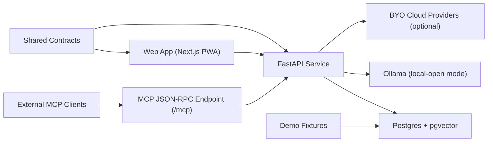

# B.I.A.S.E.D.

**Business Intelligence Assistant for Enriched Decision-Making**

B.I.A.S.E.D. is an open-source decision intelligence platform for SMB owners. It helps small businesses import historical records, track recurring obligations, investigate margin and cash shifts, and execute evidence-backed actions.

The first public product story is an India-first pharmacy and medical-store demo, while the domain model remains reusable for other SMB segments.

This repository is the current public implementation of a longer-running project concept and continues to evolve through visible milestones.

## Jump to
- [Why this project exists](#why-this-project-exists)
- [What is implemented now](#what-is-implemented-now)
- [Quickstart](#quickstart-local-development)
- [Feature evidence and demo assets](#feature-evidence-and-demo-assets)
- [Project timeline](#project-timeline)
- [Repository layout](#repository-layout)
- [Engineering quality bar](#engineering-quality-bar)

## Why this project exists
Large companies make daily decisions using analytics teams and expensive tooling. Most SMB owners do not have that support.

B.I.A.S.E.D. focuses on closing that gap with:
- practical owner workflows over generic dashboards
- local/open model support by default for low-cost adoption
- explainable recommendations with evidence and confidence traces

## What is implemented now
Current showcase scope (`v1.0.0-showcase`) includes:

### Owner operations
- import preview and confirmation for CSV/Excel business records
- recurring obligations tracking with operational status updates
- daily quick-add entries for sales, purchases, and expenses
- action queue with lifecycle states (`open`, `watching`, `snoozed`, `resolved`)

### AI analyst workflows
- investigation flow with prompt guardrails, tool use, and structured output
- LangGraph-style orchestration route with tool-call trace metadata
- retrieval-backed evidence snippets from stored business documents
- provider modes: `local-open`, `byo-cloud`, `hybrid`
- model metadata surfaced in responses (provider, mode, latency, estimated cost)
- MCP-compatible JSON-RPC server for external tool integration (`POST /mcp`)

### Forecasting and planning
- deterministic baseline forecasting for core metrics
- scenario planner for owner-facing what-if analysis
- scheduler trigger path for brief/anomaly/reminder generation

### Delivery modes
- hosted demo-friendly deployment path
- full self-hosted Docker Compose stack with Ollama
- installable PWA UX targeting Android and Windows browsers

## Architecture at a glance

Detailed architecture notes: [docs/architecture.md](docs/architecture.md)

## Quickstart (local development)
1. Install dependencies:
   - `pnpm install`
   - `uv sync --project apps/api`
2. Copy `.env.example` to `apps/web/.env.local`.
3. Start local services:
   - `pnpm docker:up`
4. Apply auth and app schema:
   - `pnpm --filter @biased/web auth:migrate`
   - `pnpm db:migrate`
5. Seed or reset demo data:
   - `pnpm demo:seed`
   - `pnpm demo:reset`
6. Run apps:
   - `pnpm web:dev`
   - `pnpm api:dev`

PostgreSQL runs on `localhost:5433` in local mode to reduce conflicts with other stacks.

## Feature evidence and demo assets
- Architecture and boundaries: [docs/architecture.md](docs/architecture.md)
- Deployment paths: [docs/deployment.md](docs/deployment.md)
- Feature-to-implementation map: [docs/feature-evidence.md](docs/feature-evidence.md)
- Demo runbook: [docs/showcase.md](docs/showcase.md)
- Roadmap and contributor entry points: [docs/roadmap.md](docs/roadmap.md)
- Demo data rules: [data/demo/README.md](data/demo/README.md)

Suggested walkthrough question set:
- `Why did profit drop this month?`
- `What are my top selling products?`
- `Which expense categories are spiking?`
- `What should I reorder next week?`

## Project timeline
- Earlier iterations: concept validation and private prototyping.
- Public rebuild milestones:
  - `v0.2.0-milestone-b-preview`
  - `v0.3.0-milestone-b-final`
  - `v0.4.0-milestone-c`
  - `v0.5.0-milestone-d`
  - `v1.0.0-showcase`
- Ongoing development: testing depth, UX hardening, and contributor-focused expansion.
 
### Versioning note
- Milestone tags in Git are the public release checkpoints.
- Workspace and API manifests are aligned to the `1.0.0` baseline to match the current showcase release track.

For release details, see [CHANGELOG.md](CHANGELOG.md).

## Repository layout
- `apps/web` — Next.js app, auth, dashboard UX, investigation, planner, PWA shell
- `apps/api` — FastAPI analytics, agent orchestration, MCP endpoint, retrieval, forecasting, scheduler flows
- `packages/contracts` — shared contracts and structured response schemas
- `packages/ui` — shared branded UI primitives
- `packages/config` — shared linting/tooling configuration
- `infra` — Docker Compose and infra descriptors
- `data/demo` — sanitized demo fixtures and anonymization tooling
- `docs` — architecture, deployment, roadmap, and showcase runbooks

## Engineering quality bar
- CI currently gates:
  - web lint + typecheck + build
  - API compile sanity
- shared contracts keep API/UI boundaries explicit
- seeded demo data supports deterministic local walkthroughs
- role-based workspace membership APIs enforce `owner/manager/accountant` boundaries
- privacy rule is strict: no raw private business data in repository history

## Deployment options
- Hosted showcase path: [docs/deployment.md](docs/deployment.md)
- Private self-hosted path (Docker + Ollama): [docs/deployment.md](docs/deployment.md#self-hosted-mode-windows-first)

## Contributing
Contribution guide: [CONTRIBUTING.md](CONTRIBUTING.md)

## Data privacy
Never commit raw private business records. Any real-world sample must be sanitized before entering this repository.

## License
Apache-2.0. See [LICENSE](LICENSE).
