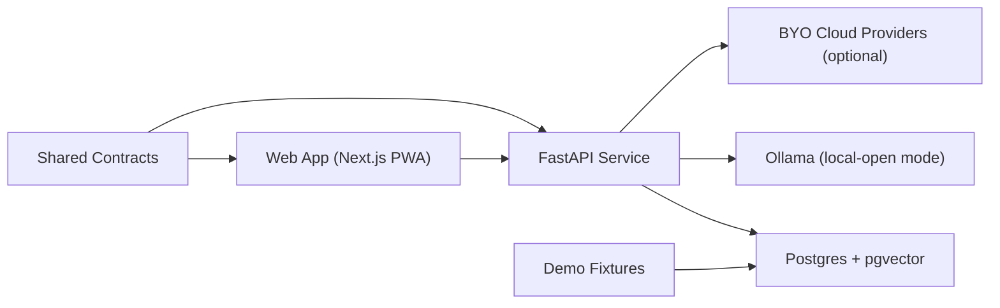

# Architecture Overview

B.I.A.S.E.D. uses a thin web shell + thin API orchestration model around a Postgres-first business memory.

## Web app (`apps/web`)

- Owner workflows: imports, documents, dashboard, quick-add, action center, ask, forecast lab
- Better Auth session integration
- PWA delivery for Android and Windows reach

## API service (`apps/api`)

- Import preview + confirm pipeline
- Recurring obligations, documents, and ledger persistence
- Investigation workflow with guardrails + citations
- Model routing profiles (`local-open`, `byo-cloud`, `hybrid`)
- Forecasting, scenarios, and scheduler runs

## Shared packages

- `packages/contracts`: shared schemas, DTOs, structured AI outputs
- `packages/ui`: reusable branded UI primitives
- `packages/config`: shared workspace config baselines

## Infrastructure

- Postgres with pgvector as default retrieval store
- Ollama for zero-cost local inference path
- Docker Compose for full self-hosted stack
